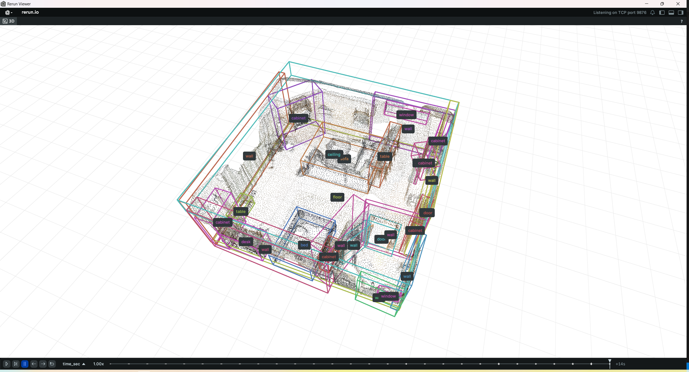

# SpaceLM 🌌



[](https://github.com/sengine-research/SpaceLM)
[](https://huggingface.co/datasets/sengine-research/preprocessed-vla-3d)
[](https://sengine-cos-1259101928.cos.ap-guangzhou.myqcloud.com/plane/Technical%20Report.pdf)
[](https://opensource.org/licenses/Apache-2.0)

## 📖 Introduction

Inspired by [SpatialLM](https://github.com/manycore-research/SpatialLM), SpaceLM is a 3D reconstruction system that can be used to reconstruct 3D models from 2D images and videos. We will improve the code and pretrained model. Stay tuned for more details and improvements.

## TODO
- [X] Release train dataset
- [X] Release dataset preprocess code
- [X] Release train code
- [ ] Release the pretrained model (Apr 10)
- [ ] Add Inference and Visualize Demo (Apr 15)

## 📦 Environment

### Train Platform

We use one A100 GPUs to train the model. 

### Python Environment
Please follow the steps below to create the environment and install the dependencies.

```bash
git clone https://github.com/sengine-research/SpaceLM.git
cd SpaceLM

conda create -n spacelm python=3.10
conda activate spacelm

# CUDA version 12.4
pip install torch torchvision torchaudio --index-url https://download.pytorch.org/whl/cu124
pip install xformers==v0.0.29.post2 --index-url https://download.pytorch.org/whl/cu124 # install xformers from table below
# CUDA version 11.8
pip install torch torchvision torchaudio --index-url https://download.pytorch.org/whl/cu118
pip install xformers==v0.0.29.post2 --index-url https://download.pytorch.org/whl/cu118 # install xformers from table below

pip install -r requirements.txt
pip install git+https://github.com/mit-han-lab/torchsparse.git # may take a long time

# install spconv cuda 12.4
pip install spconv-cu124
# install spconv cuda 11.8
pip install spconv-cu118
```

### xformer table

install xformers from the table below

eg: pip install xformers==v0.0.29.post2 --index-url https://download.pytorch.org/whl/cu118

| xformers          | pytorch     | CUDA            |
|-------------------|-------------|-----------------|
| v0.0.29.post2     | torch==2.6.0| cu118, cu124, cu126 |
| 0.0.29.post1, 0.0.29, 0.0.28.post3 | torch==2.5.1 | cu118, cu121, cu124 |
| 0.0.28.post2      | torch==2.5.0| cu118, cu121, cu124 |
| 0.0.28.post1      | torch==2.4.1| cu118, cu121, cu124 |


## 🚀 Quick Start

### Gradio Demo (TODO)

```bash
python app.py
```

### Inference and Visualize Demo  (PRE_TRAINED_MODEL_PATH TODO)

```bash
# Inference
python inference.py --model_path PRE_TRAINED_MODEL_PATH --point_cloud sample_data/scene0000_00/scene0000_00_pc_result.ply -o test.txt

# Save the result as rrd file
python visualize.py --point_cloud sample_data/scene0000_00/scene0000_00_pc_result.ply --layout test.txt --save test.rrd

# Open the rrd file in Windows system
pip install rerun-sdk
rerun test.rrd
```

## 🔍 Train Pipeline

48GB VRAM GPU machine preferred and 5 hours training time needed

### Download Qwen2.5-0.5B-Instruct and Modify the Vision Token to Point Token

```bash
modelscope download --model qwen/Qwen2.5-0.5B-Instruct --local_dir ./Qwen2.5-0.5B-Instruct

python model/modify_qwen2.5.py --model_path ./Qwen2.5-0.5B-Instruct # modify the vision token to point token
```
### Download Scenescript Pretrained Model
Download [scenescript_model_ase.ckpt](https://scontent-lax3-1.xx.fbcdn.net/m1/v/t6/An8ElJTA5VXlOkvhnT9_p33s47f0SYKFTymXzQlzGdDUG3ukkLjQwL4ieWZE7rY9F8Puz1OlEt6qQjmtu7Ej5HYkpBZJ3YR1cv3YlzZjwlIVTa9-e7ry5bxWsM3IMoTzB8XgpJ8aDso.ckpt/scenescript_model_ase.ckpt?_nc_oc=Adlt5JD0mJ63qjrhLHNuVNihjqUpFtmGHt74RYNQj2-_BqLp8-HCItPxuR3umyiwil8EOGr8P7ervUfxUoQ_SSZ1&sdl=1&ccb=10-5&oh=00_AYFChMAq3fCIqrAUEPo91IfgxaVI4XgpUGueZ9Ah6_3G7A&oe=68148F33&_nc_sid=1a752d) and put scenescript_model_ase.ckpt to the root dir of the project.

### Train on Scannet Dataset (For Example)

Thanks to [VLA-3D](https://github.com/HaochenZ11/VLA-3D), we can get six most popular open source dataset (Scannet / Matterport / HM3D / Unity / ARKitScenes / 3RScan) with same format for easy training. We use Scannet as an example to show how to train the model. For other dataset(Matterport / HM3D / Unity / ARKitScenes / 3RScan), you can refer to the code and train it by yourself.

#### Download Dataset

```bash
git lfs install
git clone https://huggingface.co/datasets/sengine-research/preprocessed-vla-3d

mkdir 3D_dataset
unzip ./preprocessed-vla-3d/Scannet.zip -d ./3D_dataset/
```

#### Preprocess Data
```bash
python dataset/preprocess_data_scene_script.py --data_path 3D_dataset --dataset_name Scannet
```

after preprocess, you will get the preprocessed data in the folder `preprocessed_data_scene_script`.

#### Train
```bash
python train.py  --dataset_dir preprocessed_data_scene_script --dataset_name Scannet --model_path ./Qwen2.5-0.5B-Instruct --exp_path YOUR_EXP_PATH --exp_name YOUR_EXP_NAME --stage_1_epochs EPOCH_NUM --stage_2_epochs EPOCH_NUM --batch_size BATCH_SIZE --gradient_accumulation_steps GRADIENT_ACCUMULATION_STEPS --learning_rate LEARNING_RATE --save_per_epoch SAVE_PER_EPOCH

# example
python train.py  --dataset_dir preprocessed_data_scene_script --dataset_name Scannet --model_path ./Qwen2.5-0.5B-Instruct --exp_path ./exp --exp_name space_lm_model_qwen_llm_lr_1e-6_point_lr_1e-5 --stage_1_epochs 4 --stage_2_epochs 10 --batch_size 1 --gradient_accumulation_steps 16 --learning_rate 5e-6 --save_per_epoch 2
```

We use two stages to train the model. The first stage is to train the point backbone model and the second stage is to train the whole model on the Scannet dataset.

#### Inference and Visualize
```bash
python inference.py --model_path YOUR_EXP_PATH/YOUR_EXP_NAME/EPOCH_NUM --point_cloud PLY_FILE -o OUTPUT_FILE

python visualize.py --point_cloud PLY_FILE --layout OUTPUT_FILE --save OUTPUT_FILE.rrd

rerun OUTPUT_FILE.rrd # on windows

# example
python inference.py --model_path exp/space_lm_model_qwen_llm_lr_1e-5_point_lr_1e-4_no_stage_1_Scannet/stage_2/epoch_0 --point_cloud sample_data/scene0000_00/scene0000_00_pc_result.ply -o test.txt

python visualize.py --point_cloud sample_data/scene0000_00/scene0000_00_pc_result.ply --layout test.txt --save test.rrd

rerun test.rrd  # on windows
```


## 📚 Contributing

We welcome contributions in the following ways:
1. Submit an Issue to report problems
2. Create a Pull Request to improve the code
3. Complete the project documentation
4. Share your usage examples


## 🤝 Acknowledgements

This work is inspired by the following projects:

[SpatialLM](https://github.com/manycore-research/SpatialLM) | [Qwen2.5](https://github.com/QwenLM/Qwen2.5) | [SceneScript](https://github.com/facebookresearch/scenescript) | [VLA-3D](https://github.com/HaochenZ11/VLA-3D)